```mermaid
flowchart TB
    subgraph current["docker-compose.dcproj"]
        MAIN["<b>📦&nbsp;docker-compose.dcproj</b><br/><small></small>"]
        click MAIN "#docker-composedcproj"
    end

```

```mermaid
flowchart TB
    subgraph current["RiftARENA.csproj"]
        MAIN["<b>📦&nbsp;RiftARENA.csproj</b><br/><small>net7.0</small>"]
        click MAIN "#riftarenariftarenacsproj"
    end

```

# Projects and dependencies analysis

This document provides a comprehensive overview of the projects and their dependencies in the context of upgrading to .NETCoreApp,Version=v10.0.

## Table of Contents

- [Executive Summary](#executive-Summary)
  - [Highlevel Metrics](#highlevel-metrics)
  - [Projects Compatibility](#projects-compatibility)
  - [Package Compatibility](#package-compatibility)
  - [API Compatibility](#api-compatibility)
- [Aggregate NuGet packages details](#aggregate-nuget-packages-details)
- [Top API Migration Challenges](#top-api-migration-challenges)
  - [Technologies and Features](#technologies-and-features)
  - [Most Frequent API Issues](#most-frequent-api-issues)
- [Projects Relationship Graph](#projects-relationship-graph)
- [Project Details](#project-details)

  - [docker-compose.dcproj](#docker-composedcproj)
  - [RiftARENA\RiftARENA.csproj](#riftarenariftarenacsproj)

## Executive Summary

### Highlevel Metrics

| Metric | Count | Status |
| :--- | :---: | :--- |
| Total Projects | 2 | 1 require upgrade |
| Total NuGet Packages | 18 | 12 need upgrade |
| Total Code Files | 40 |  |
| Total Code Files with Incidents | 5 |  |
| Total Lines of Code | 5957 |  |
| Total Number of Issues | 34 |  |
| Estimated LOC to modify | 19+ | at least 0,3% of codebase |

### Projects Compatibility

| Project | Target Framework | Difficulty | Package Issues | API Issues | Est. LOC Impact | Description |
| :--- | :---: | :---: | :---: | :---: | :---: | :--- |
| [docker-compose.dcproj](#docker-composedcproj) |  | ✅ None | 0 | 0 |  | DotNetCoreApp, Sdk Style = True |
| [RiftARENA\RiftARENA.csproj](#riftarenariftarenacsproj) | net7.0 | 🟢 Low | 14 | 19 | 19+ | AspNetCore, Sdk Style = True |

### Package Compatibility

| Status | Count | Percentage |
| :--- | :---: | :---: |
| ✅ Compatible | 6 | 33,3% |
| ⚠️ Incompatible | 3 | 16,7% |
| 🔄 Upgrade Recommended | 9 | 50,0% |
| ***Total NuGet Packages*** | ***18*** | ***100%*** |

### API Compatibility

| Category | Count | Impact |
| :--- | :---: | :--- |
| 🔴 Binary Incompatible | 6 | High - Require code changes |
| 🟡 Source Incompatible | 11 | Medium - Needs re-compilation and potential conflicting API error fixing |
| 🔵 Behavioral change | 2 | Low - Behavioral changes that may require testing at runtime |
| ✅ Compatible | 6480 |  |
| ***Total APIs Analyzed*** | ***6499*** |  |

## Aggregate NuGet packages details

| Package | Current Version | Suggested Version | Projects | Description |
| :--- | :---: | :---: | :--- | :--- |
| Azure.Identity | 1.11.4 |  | [RiftARENA.csproj](#riftarenariftarenacsproj) | ⚠️NuGet package is deprecated |
| Microsoft.AspNetCore.Authentication.JwtBearer | 7.0.14 | 10.0.1 | [RiftARENA.csproj](#riftarenariftarenacsproj) | NuGet package upgrade is recommended |
| Microsoft.AspNetCore.Mvc.NewtonsoftJson | 7.0.14 | 10.0.1 | [RiftARENA.csproj](#riftarenariftarenacsproj) | NuGet package upgrade is recommended |
| Microsoft.AspNetCore.SignalR.Protocols.NewtonsoftJson | 7.0.14 | 10.0.1 | [RiftARENA.csproj](#riftarenariftarenacsproj) | NuGet package upgrade is recommended |
| Microsoft.EntityFrameworkCore | 7.0.14 | 10.0.1 | [RiftARENA.csproj](#riftarenariftarenacsproj) | NuGet package upgrade is recommended |
| Microsoft.EntityFrameworkCore.Design | 7.0.14 | 10.0.1 | [RiftARENA.csproj](#riftarenariftarenacsproj) | NuGet package upgrade is recommended |
| Microsoft.EntityFrameworkCore.Proxies | 7.0.14 | 10.0.1 | [RiftARENA.csproj](#riftarenariftarenacsproj) | NuGet package upgrade is recommended |
| Microsoft.EntityFrameworkCore.SqlServer | 7.0.14 | 10.0.1 | [RiftARENA.csproj](#riftarenariftarenacsproj) | NuGet package upgrade is recommended |
| Microsoft.EntityFrameworkCore.Tools | 7.0.14 | 10.0.1 | [RiftARENA.csproj](#riftarenariftarenacsproj) | NuGet package upgrade is recommended |
| Microsoft.VisualStudio.Azure.Containers.Tools.Targets | 1.19.6 |  | [RiftARENA.csproj](#riftarenariftarenacsproj) | ⚠️NuGet package is incompatible |
| Microsoft.VisualStudio.Web.CodeGeneration.Design | 7.0.11 | 10.0.1 | [RiftARENA.csproj](#riftarenariftarenacsproj) | NuGet package upgrade is recommended |
| NuGet.Common | 6.8.0 |  | [RiftARENA.csproj](#riftarenariftarenacsproj) | ✅Compatible |
| NuGet.Protocol | 6.8.0 |  | [RiftARENA.csproj](#riftarenariftarenacsproj) | ✅Compatible |
| Swashbuckle.AspNetCore | 6.5.0 |  | [RiftARENA.csproj](#riftarenariftarenacsproj) | ✅Compatible |
| Swashbuckle.AspNetCore.SwaggerUI | 6.5.0 |  | [RiftARENA.csproj](#riftarenariftarenacsproj) | ✅Compatible |
| System.IdentityModel.Tokens.Jwt | 7.3.1 |  | [RiftARENA.csproj](#riftarenariftarenacsproj) | ⚠️NuGet package is deprecated |
| System.Net.Http | 4.3.4 |  | [RiftARENA.csproj](#riftarenariftarenacsproj) | NuGet package functionality is included with framework reference |
| System.Text.RegularExpressions | 4.3.1 |  | [RiftARENA.csproj](#riftarenariftarenacsproj) | NuGet package functionality is included with framework reference |

## Top API Migration Challenges

### Technologies and Features

| Technology | Issues | Percentage | Migration Path |
| :--- | :---: | :---: | :--- |
| IdentityModel & Claims-based Security | 4 | 21,1% | Windows Identity Foundation (WIF), SAML, and claims-based authentication APIs that have been replaced by modern identity libraries. WIF was the original identity framework for .NET Framework. Migrate to Microsoft.IdentityModel.* packages (modern identity stack). |

### Most Frequent API Issues

| API | Count | Percentage | Category |
| :--- | :---: | :---: | :--- |
| M:System.Exception.#ctor(System.Runtime.Serialization.SerializationInfo,System.Runtime.Serialization.StreamingContext) | 2 | 10,5% | Source Incompatible |
| T:System.Net.Http.HttpContent | 2 | 10,5% | Behavioral Change |
| T:Microsoft.AspNetCore.Authentication.JwtBearer.JwtBearerDefaults | 2 | 10,5% | Source Incompatible |
| F:Microsoft.AspNetCore.Authentication.JwtBearer.JwtBearerDefaults.AuthenticationScheme | 2 | 10,5% | Source Incompatible |
| M:System.IdentityModel.Tokens.Jwt.JwtSecurityTokenHandler.WriteToken(Microsoft.IdentityModel.Tokens.SecurityToken) | 1 | 5,3% | Binary Incompatible |
| M:System.IdentityModel.Tokens.Jwt.JwtSecurityTokenHandler.CreateToken(Microsoft.IdentityModel.Tokens.SecurityTokenDescriptor) | 1 | 5,3% | Binary Incompatible |
| T:System.IdentityModel.Tokens.Jwt.JwtSecurityTokenHandler | 1 | 5,3% | Binary Incompatible |
| M:System.IdentityModel.Tokens.Jwt.JwtSecurityTokenHandler.#ctor | 1 | 5,3% | Binary Incompatible |
| P:Microsoft.AspNetCore.Authentication.JwtBearer.JwtBearerOptions.TokenValidationParameters | 1 | 5,3% | Source Incompatible |
| P:Microsoft.AspNetCore.Authentication.JwtBearer.JwtBearerOptions.SaveToken | 1 | 5,3% | Source Incompatible |
| P:Microsoft.AspNetCore.Authentication.JwtBearer.JwtBearerOptions.RequireHttpsMetadata | 1 | 5,3% | Source Incompatible |
| T:Microsoft.Extensions.DependencyInjection.JwtBearerExtensions | 1 | 5,3% | Source Incompatible |
| M:Microsoft.Extensions.DependencyInjection.JwtBearerExtensions.AddJwtBearer(Microsoft.AspNetCore.Authentication.AuthenticationBuilder,System.Action{Microsoft.AspNetCore.Authentication.JwtBearer.JwtBearerOptions}) | 1 | 5,3% | Source Incompatible |
| M:Microsoft.Extensions.Configuration.ConfigurationBinder.Get''1(Microsoft.Extensions.Configuration.IConfiguration) | 1 | 5,3% | Binary Incompatible |
| M:Microsoft.Extensions.DependencyInjection.OptionsConfigurationServiceCollectionExtensions.Configure''1(Microsoft.Extensions.DependencyInjection.IServiceCollection,Microsoft.Extensions.Configuration.IConfiguration) | 1 | 5,3% | Binary Incompatible |

## Projects Relationship Graph

Legend:
📦 SDK-style project
⚙️ Classic project

```mermaid
flowchart LR
    P1["<b>📦&nbsp;RiftARENA.csproj</b><br/><small>net7.0</small>"]
    P2["<b>📦&nbsp;docker-compose.dcproj</b><br/><small></small>"]
    click P1 "#riftarenariftarenacsproj"
    click P2 "#docker-composedcproj"

```

## Project Details

### docker-compose.dcproj

#### Project Info

- **Current Target Framework:** ✅
- **SDK-style**: True
- **Project Kind:** DotNetCoreApp
- **Dependencies**: 0
- **Dependants**: 0
- **Number of Files**: 0
- **Lines of Code**: 0
- **Estimated LOC to modify**: 0+ (at least 0,0% of the project)

#### Dependency Graph

Legend:
📦 SDK-style project
⚙️ Classic project

### API Compatibility

| Category | Count | Impact |
| :--- | :---: | :--- |
| 🔴 Binary Incompatible | 0 | High - Require code changes |
| 🟡 Source Incompatible | 0 | Medium - Needs re-compilation and potential conflicting API error fixing |
| 🔵 Behavioral change | 0 | Low - Behavioral changes that may require testing at runtime |
| ✅ Compatible | 0 |  |
| ***Total APIs Analyzed*** | ***0*** |  |

### RiftARENA\RiftARENA.csproj

#### Project Info

- **Current Target Framework:** net7.0
- **Proposed Target Framework:** net10.0
- **SDK-style**: True
- **Project Kind:** AspNetCore
- **Dependencies**: 0
- **Dependants**: 0
- **Number of Files**: 43
- **Number of Files with Incidents**: 5
- **Lines of Code**: 5957
- **Estimated LOC to modify**: 19+ (at least 0,3% of the project)

#### Dependency Graph

Legend:
📦 SDK-style project
⚙️ Classic project

### API Compatibility

| Category | Count | Impact |
| :--- | :---: | :--- |
| 🔴 Binary Incompatible | 6 | High - Require code changes |
| 🟡 Source Incompatible | 11 | Medium - Needs re-compilation and potential conflicting API error fixing |
| 🔵 Behavioral change | 2 | Low - Behavioral changes that may require testing at runtime |
| ✅ Compatible | 6480 |  |
| ***Total APIs Analyzed*** | ***6499*** |  |

#### Project Technologies and Features

| Technology | Issues | Percentage | Migration Path |
| :--- | :---: | :---: | :--- |
| IdentityModel & Claims-based Security | 4 | 21,1% | Windows Identity Foundation (WIF), SAML, and claims-based authentication APIs that have been replaced by modern identity libraries. WIF was the original identity framework for .NET Framework. Migrate to Microsoft.IdentityModel.* packages (modern identity stack). |

